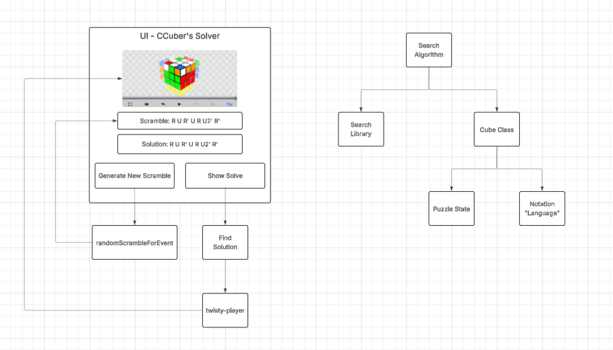
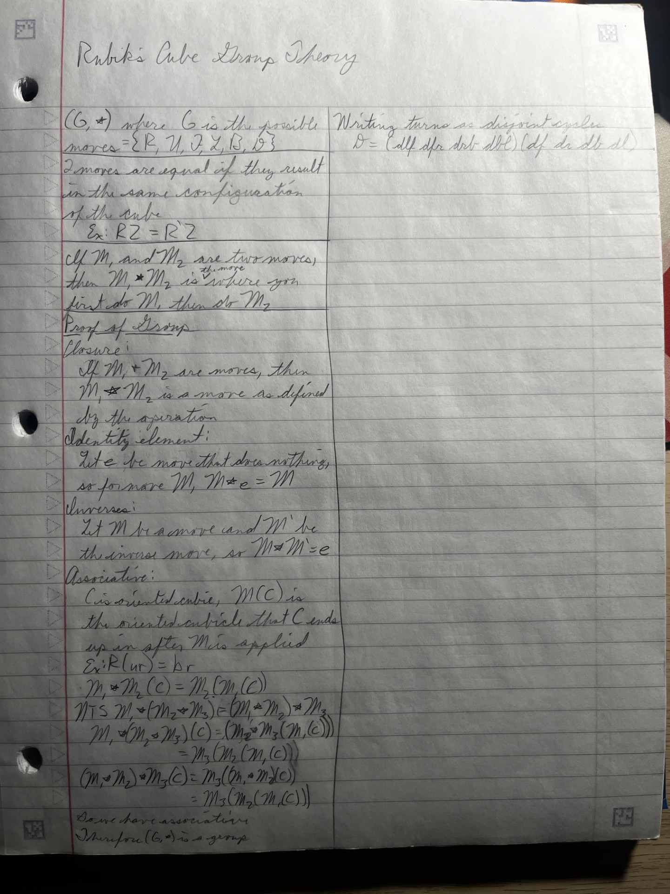

# Rubik's Solver
Senior Capstone project to solve a Rubik's 3x3 cube.

## Problem
Can we find God's number (20 moves) for any 3x3 Rubik's Cube scramble?

## Objectives
- Analyze search algorithms to find the fastest and most efficient
- Implement a puzzle solving algorithm that finds the fewest moves to solve the puzzle
- Develop a UI to display the puzzle's scramble and the solve steps
- Create database to improve algorithm speed

## Technicalities
Algorithm will be implemented in C++. I will use a search algorithm to solve this problem, similar to those in CSC
481 - Artificial Intelligence. Goal is to explore different algorithms to solve a puzzle. Main foundation for some is
Iterative Deepening A*. I will be considering a bidirectional search.

For the UI to generate a scramble, I will use `cubing.js` that generates WCA and some non-WCA puzzle scrambles. This
library will also be used to visualize the scramble and solve of the puzzle. Link provided
[here](https://js.cubing.net/cubing/). I will wrap the C++ code in Python to utilize websockets in Python to communicate with the JavaScript for
the UI.

## Architecture

## Project Timeline
- Phase 1
    - Learn Rubik's Cube group theory
    - Learn how to represent a cube and state transformations
    - Select algorithm to use
    - Fully implement first algorithm
- Phase 2
    - Implement other algorithms and begin comparison
    - Begin work on the UI
    - Finalize unit testing
- Phase 3
    - Finalize UI
    - Polish documentation and algorithm reporting
- Stretch Phase
    - Add other puzzle solvers (2x2, 4x4, Megaminx, etc.)
    - Add smart cube connection with Bluetooth
    - Add database search system

## Phase 1
Notes from learning group theory.
